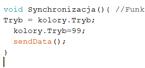
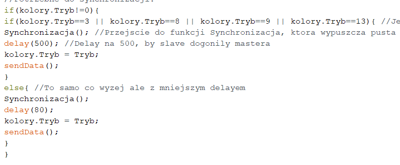
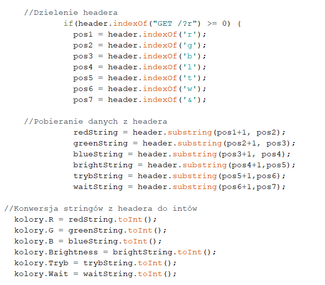

1.	Opis:

Sterowanie listwami LED WS2B12B z poziomu strony internetowej rozgłaszanej poprzez ESP32. Komunikacja za pomocą protokołu ESPNow. Wyświetlanie za pomocą biblioteki NeoPixel.

Przygotowano dwa warianty programu:

a)	Master wyłącznie wysyła informacje co mają wyświetlić pozostałe płytki na podstawie danych przesłanych przez stronę.

b)	Master wysyła informacje co maja wyświetlić wszystkie płytki wraz z samym masterem na podstawie danych przesłanych przez stronę.

Drugi wariant względem pierwszego różni się dodanym buttonem, który po naciśnięciu odpala serwer i funkcją do synchronizacji wykonywaną przy każdym loopie. Dodatkowo przez błąd w bibliotece NeoPixel ESP32 prawidłowo wyświetla tylko listwy z maksymalną ilością 33 pikseli. By rozwiązać problem trzeba skorzystać z biblioteki FastLed lub forka biblioteki NeoPixel i przepisać wszystkie funkcje.

2.	Funkcje:

●	Obsługa do 20 płytek ESP8266 pełniących rolę slave

●	Automatyczne rozgłaszanie adresów MAC przez każdego slave

●	Automatyczne wyszukiwanie i dodawanie do listy klientów okolicznych slave przez mastera

●	10 funkcji wyświetlania

●	Rozgłaszanie sieci o określonym SSID i haśle

●	Sterowanie listwami LED z poziomu strony internetowej

Dodatkowe funkcje w wariancie drugim:

●	Button do ponownego uruchamiania serwera WEB

●	Synchronizacja między masterem a slaveami

3.	Schemat:

4.	Instrukcja uruchomienia:

1.	Wgranie kodu przeznaczonego dla mastera na ESP32 z domyślną częstotliwością 240MHz (160MHz dla wariantu drugiego)
2.	Wgranie kodu przeznaczone dla slaveów na płytki ESP8266 z zmienioną częstotliwością na 160MHz (funkcja tęczy dzięki temu płynniej się wyświetla)
3.	Podłączenie wszystkiego według schematu z punktu trzeciego
4.	Podłączenie się do sieci wifi rozgłaszanej przez ESP32 o SSID: ESP32-Access-Point i haśle 123456789
5.	Wejście na przeglądarce internetowej na adres 192.168.4.1 gdzie teraz wyświetlany jest panel kontrolny
6.	Wybranie interesującego nas trybu i koloru oraz naciśnięcie ,,Wyślij”

Jeśli korzystamy z wariantu drugiego to po naciśnięciu przycisku ,,Wyślij” na trybie innym niż światło stałe serwer zostanie zamknięty do momentu aż nie zostanie naciśnięty przycisk.

5.	Problemy:

W trakcie pracy nad projektem spotkałem się z trzema większymi problemami. Synchronizacją mastera i slaveów, sposobem na przesyłanie informacji podanej przez stronę internetową do zmiennych w kodzie oraz mechanizmem jednoczesnego rozgłaszania sieci i wyświetlania kolorów na masterze.

a)	Problem synchronizacji

Procesor ESP32 bazowo pracuje z taktowaniem 240MHz, natomiast procesor ESP8266 z zaledwie 80MHz dlatego cięższe funkcje po stronie ESP32 czyli mastera wykonywały się szybciej co skutkowało desynchronizacją. W trakcie wgrywania kodu do płytek poprzez Arduino IDE mamy opcję ustawienia obu płytek na 160MHz co z założenia powinno pozbyć się problemu. Niestety nawet w takim przypadku ESP32 jest delikatnie szybsze od ESP8266 dlatego w kodzie trzeba, było zastosować funkcję do synchronizacji.

 

Funkcja jedyne co robi to wykorzystując zmienna pomocniczą Tryb przechowuje aktualnie wyświetlany tryb. Następnie ustawia aktualnie wyświetlany tryb na 99 i wysyła tą informację do wszystkich podłączonych listw. Sam tryb 99 nic nie robi i w trakcie jego wykonywania wszystkie płytki czekają na kolejną informację od mastera.

Na końcu funkcji loop z góry ustawiony jest delay, po którym ponownie wysyłany jest aktualnie wyświetlany tryb. Mniejszy delay oznacza mniej zauważalną przerwę w wyświetlaniu ale za mały delay doprowadzi do desynchronizacji.

 

Tak jak widać wyżej poszczególne cięższe funkcje takie jak tęcza czy funkcja symulujaca efekt spadającego meteoru mają ustawiony bezpiecznie delay na pół sekundy a mniej wymagające na zaledwie 80ms. Metodą prób i błędów można zmniejszyć delay do mniejszych wartości.

Dodatkowo funkcje w wariancie drugim mają zmniejszoną ilość powtórzeń w trakcie jednego loopa, by jak najbardziej zniwelować problem desynchronizacji.

b)	Problem przekazywania danych przez stronę internetowa do zmiennych

Stawiając web server na ESP możemy spotkać się z funkcją handleClient(), dzięki której dałoby się wyświetlić z góry przewidziane kolory i funkcje ale nie możemy za jej pomocą przesłać dokładnej wartości RGB jaka nas interesuje. Metodą, którą użyłem jest przesłanie danych poprzez nagłówek strony. Główna strona wyświetla panel z sliderami umożliwiającymi ustawienie koloru, jasności i trybu oraz pole tekstowe na wartość opóźnienia w milisekundach. Funkcja w javascripcie przesyła wszystkie te informacje do adresu (headera) strony razem z ustawionymi pomiędzy wartościami dzielnikami. Dzięki temu program może podzielić header na odpowiednie części i przesłać odpowiednie wartości do zmiennych.

c)	Problem jednoczesnego wyświetlania kolorów oraz rozgłaszania serwera na masterze

WebServer postawiony na ESP ma wadę, przez którą nie można jednocześnie wyświetlać skomplikowanej funkcji i utrzymywać włączonego serwera. W przypadku gdy strona rozgłaszana jest tylko wtedy gdy do serwera podłączony jest jakiś klient po każdym podłączeniu klienta master przestaje przez krótką chwilę wyświetlać. Dodatkowo po przesłaniu danych i rozłączeniu występuje problem z serwerem, który dalej znajduje nowych klientów, którzy nie istnieją przez dwa kolejne loopy co jeszcze bardziej desynchronizuje listwy. Jako rozwiązanie problemu wykorzystałem przycisk, po którego naciśnięciu wszystkie funkcje są resetowane i odpalany jest ponownie serwer. W przypadku światła stałego serwer jest włączony przez cały czas.

6.	Kod:

Cały ważny kod po stronie slave i mastera jest najdokładniej okomentowany w wariancie b). Dostępny w tym repozytorium oraz pod poniższymi linkami. Kod można zmodyfikować i wykorzystać do innych projektów.

Master wariant a)

https://pastebin.com/X7Mev3v9

Slave wariant a)

https://pastebin.com/b1J7Lgmp

Master wariant b)

https://pastebin.com/S6f47hrv

Slave wariant b)

https://pastebin.com/9J5iHPkt

